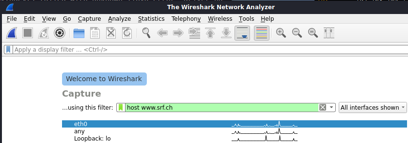
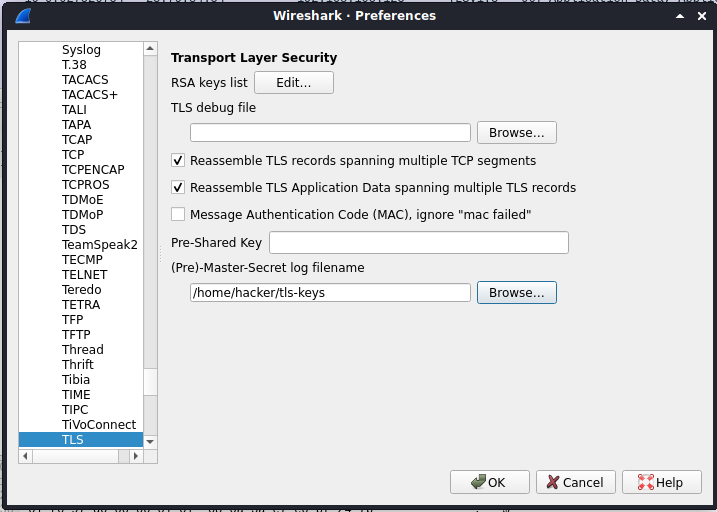

# Lab: TLS Decryption

-   Zeitaufwand:        ⏱️⏱️
-   Schwierigkeitsgrad: 🌶🌶
-   Beschreibung: In diesem Lab entschlüsseln Sie eine TLS-Verbindung, um deren Inhalt einzusehen und zu analysieren. Dabei soll das Verständnis der Funktionsweise von TLS vertieft werden.

## Voraussetzung & Vorbereitung

-   Kali Linux

## Aufgabe

Transport Layer Security (TLS) verschlüsselter Datenverkehr lässt sich bspw. mit Wireshark aufzeichnen und entschlüsseln, wenn die Keys bekannt sind. Grundsätzlich gibt es dazu die [zwei Ansätze](https://wiki.wireshark.org/TLS) _RSA Private Key_ und _Per-Session Secret_:

-   **RSA Private Key**: Aufgezeichneter Datenverkehr wird anhand des RSA private key des Servers entschlüsselt. Dazu muss dieser private key bekannt sein.

-   **Per-Session Secret**: Aufgezeichneter Datenverkehr wird anhand der Session spezifischer keys entschlüsselt. Diese Keys sind pro TLS-Session einzigartig und müssen entsprechend vorliegen.

Wir konzentrieren uns auf die zweite Methode.

1.  Öffnen Sie Wireshark und setzen Sie den Capture Filter auf `host www.srf.ch` wie im Screenshot beschrieben. Starten Sie den Packet Capture.

    

2.  Öffnen Sie ein non-root Terminal (Alt + Enter) und führen Sie folgende Befehle aus.

        export SSLKEYLOGFILE="/home/hacker/tls-keys"

    Die Ausgabe sollte entsprechend aussehen:

        echo $SSLKEYLOGFILE
        /home/hacker/tls-keys

    Nun den Browser Chromium direkt aus demselben Terminal starten:

        chromium https://www.srf.ch/

3.  Surfen Sie nun etwas auf der Webseite und generieren Sie dadurch Netzwerkverkehr. Wireshark dürfte so ähnlich aussehen, wenn Sie im Display Filter auf `tls` filtern.

    

4.  Schliessen Sie nun den Browser und lassen Sie sich mit dem Befehl `cat` den Inhalt der Datei `/home/hacker/tls-keys` anzeigen. Die Ausgabe kann umfangreich sein, die Essenz könnte aber wie folgt aussehen:

        CLIENT_HANDSHAKE_TRAFFIC_SECRET 4c7d3e3d80e4eea07fd946ebdfd5932b8d3ef52040da9c66624e1b859dacd281 5f3c6c94024a1423cd0859e10344f101faa4927b147e97122b92988b9da2fff01215e5ba4a215fed8ba57c732b3806cb
        SERVER_HANDSHAKE_TRAFFIC_SECRET 4c7d3e3d80e4eea07fd946ebdfd5932b8d3ef52040da9c66624e1b859dacd281 45753707d3c67287143eb87e651f8f240c4a518a7f1724e1a257a41fb97f5c8f5ada929c4d02a77aaad6e2af3bb1a182        
        CLIENT_TRAFFIC_SECRET_0 4c7d3e3d80e4eea07fd946ebdfd5932b8d3ef52040da9c66624e1b859dacd281 cf450291f2b83472ac650d88a99bf3a7fa77f14a701c6bb21eeab31ca934609c9ceed38879e95ca944d7300e32927438
        SERVER_TRAFFIC_SECRET_0 4c7d3e3d80e4eea07fd946ebdfd5932b8d3ef52040da9c66624e1b859dacd281 ac798680ba9f1e578788c856352c6468736e8b6188d1e61dcd5b2d4fa67c3344b458c6460225fc9941687bb13298e484
        EXPORTER_SECRET 4c7d3e3d80e4eea07fd946ebdfd5932b8d3ef52040da9c66624e1b859dacd281 82509f6a0cbdf373b586919b5787160f292edd39d5a9c2c2213b3f6db029c963ae00cdf77269ab91a043d3cd129c4cbc

    Jede Zeile beinhaltet die nötigen Informationen, um eine TLS-Verbindung Schritt-für-Schritt zu entschlüsseln. Der Aufbau einer Zeile folgt immer derselben Struktur:

    `[Label] [ClientRandom] [Secret]`

    Die einzelnen Phasen einer TLS-Verschlüsselung werden über das _Label_ abgebildet. Da jede TLS-Session eindeutig über deren Zufallswert _ClientRandom_ identifiziert werden kann, muss diese Information auf jeder Zeile vorhanden sein, sodass eine Zuordnung von Secrets zur TLS-Session hergestellt werden kann. Als _Secret_ wird dann der Schlüssel zur Ver- respektive Entschlüsselung angegeben.

    Im [Mozilla Developer Network](https://developer.mozilla.org/en-US/docs/Mozilla/Projects/NSS/Key_Log_Format) ist das `SSLKEYLOGFILE` Format im Detail beschrieben.

5.  Wireshark muss nun so konfiguriert werden, dass die aufgezeichneten Verbindungen mit den Secrets aus `/home/hacker/tls-keys` entschlüsselt werden können. Dazu im Menu auf `Edit` > `Preferences` und links im Baum auf `Protocols` zum Eintrag `TLS` gehen. Hier kann das Feld `(Pre)-Master-Secret log filename` auf `/home/hacker/tls-keys` konfiguriert werden. Mit `OK` bestätigen und der Datenverkehr sollte in Wireshark automatisch entschlüsselt werden.

    

6.  Wenn Sie die aufgezeichneten Daten nun nach `http2` filtern, sehen Sie die Klartextkommunikation zwischen Client und Server.

    

## Fragen

Alle Fragen beziehen sich auf das Wireshark File `res/secret-network-traffic.pcapng`, die Keys finden Sie in `res/lab-keys`. Schränken Sie den Display Filter auf den TCP Stream 1 `tcp.stream eq 1` ein.

1.  Welche TLS Version und welche Cipher Suite wurde ausgehandelt? Nennen Sie auch die Paketnummern, wo Sie diese Information gefunden haben.

2.  Ein TLS Handshake endet bekanntlich mit einer _Finished_ Nachricht. Wer schickt in diesem Handshake zuerst die _Finished_ Nachricht, der Client oder der Server? Nennen Sie die Paketnummern beider _Finished_ Nachrichten.

3.  Finden Sie die URL des Artikels, welcher in diesem Wireshark Mitschnitt gelesen wurde. Als Lösung erwartet wird lediglich die URL (der [URL Pfad](https://de.wikipedia.org/wiki/Uniform_Resource_Locator#Pfad_(Path)) zum Artikel ist auch ausreichend).

## Bemerkungen

-   Achten Sie darauf, dass Sie auf Ihren produktiv genutzten Systemen die Umgebungsvariable `$SSLKEYLOGFILE` **nicht** gesetzt haben. Sonst könnten Applikationen wie Ihr Browser diese berücksichtigen und geheimes Schlüsselmaterial in die Datei exportieren.
